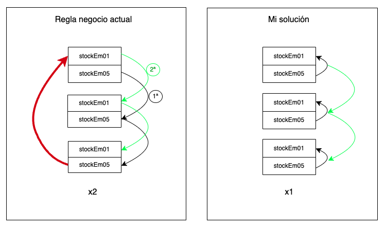

## Basic Usage

1. **Install dependencies:**
   ```sh
   npm install
   ```

2. **Run Test:**
- **Fist start docker containers for tests**
   ```sh
   make docker-test-start
   ``` 
- **Second run the test**
   ```sh
   npm test
   ```
- **Finally stop all docker containers used in tests**
   ```sh
   make docker-test-stop 
   ```
   
# Solutions

## Exercise 2

### API Requirements:
A secure endpoint would be exposed using HTTPS that would handle GET requests. In this case, the information would come in the request body, which would then be processed by the service previously implemented in exercise 1. This service would be responsible for obtaining the information and returning it to the client efficiently.

### Security:
- **Authentication and Authorization:** To ensure that only authenticated users access the endpoint, robust token-based authentication (JWT or OAuth 2.0) would be implemented. Additionally, role-based access control (RBAC) or access control lists (ACL) would be used to ensure that only users with specific permissions can access certain operations.
- **Data Protection:** It is essential not to expose sensitive data such as passwords or personal information in logs or API responses. Encryption techniques would be used both in transit (SSL/TLS) and at rest (AES-256) to protect sensitive information.
- **API Key Security:** API keys and tokens would be managed securely using tools like AWS Secrets Manager or HashiCorp Vault, ensuring that credentials are not stored in code or environment variables.
- **Attack Prevention:** Protection against common attacks such as Cross-Site Scripting (XSS), SQL Injection, and Cross-Site Request Forgery (CSRF) would be implemented. This would involve good coding practices such as input validation, data sanitization, and the use of ORM (Object Relational Mapping) for database queries.
- **Rate Limiting and DDoS Protection:** Rate limiting would be applied to prevent a single client from abusing the API, using tools like AWS API Gateway or nginx with appropriate configuration. A DDoS protection system would also be implemented through services like AWS Shield.

### Performance Considerations:
#### Database:
- **Cloud Storage:** The database would be hosted in a region close to the server to reduce latency. Distributed and scalable databases like Amazon Aurora or Google Cloud Spanner would be used to ensure high availability and horizontal scalability.
- **Query Optimization:** All queries would be optimized using appropriate indexes to avoid bottlenecks. For complex queries, techniques such as sharding (data distribution across multiple databases) and replication would be used to ensure fast access.
- **Query Caching:** In addition to query optimization, an in-memory cache system would be implemented using tools like Redis or Memcached. This system would store results of frequent or infrequently changing queries, reducing database load and improving response times.

#### Scalability and Concurrency:
- **High Concurrency Handling:** Given the high concurrency nature of the logistics exercise, a distributed locking system using Redis or Zookeeper would be implemented to ensure no concurrent access to critical resources like stock, avoiding race conditions.
- **Atomic Operations:** To avoid inconsistencies in database operations, atomic operations like findOneAndUpdate in MongoDB or transactions in SQL databases would be used. This would ensure that stock modifications are performed consistently, even with multiple users accessing the system simultaneously.
- **Message Queues:** Message queues like RabbitMQ or Amazon SQS would be used to process asynchronous tasks such as stock updates or notification sending without affecting the real-time user experience.

#### Data Pagination:
- **Efficient Pagination:** To handle large volumes of data, especially in the delivery proposals section, an efficient pagination system using techniques like cursor-based pagination would be implemented. This would allow users to receive data in blocks, avoiding network overload and client memory saturation.

### Performance and Scalability Improvements:
- **Horizontal Scalability:** The system would be designed to scale horizontally, both at the application and database levels, meaning more service instances or databases could be added as demand increases. Tools like Docker and Kubernetes would be fundamental for automatic deployment and orchestration of instances.
- **Microservices and Decoupling:** If the system grows, a microservices architecture could be implemented to separate different system functionalities (stock management, user management, etc.). This would allow each component to be developed and scaled independently.
- **CDN (Content Delivery Network):** To improve load speed and reduce latency, especially for clients located in different regions, a CDN (Content Delivery Network) would be implemented to cache static resources (images, JS files, etc.).

### Monitoring and Maintenance:
- **Logging and Traceability:** A centralized logging system like ELK Stack (Elasticsearch, Logstash, Kibana) or AWS CloudWatch would be used to monitor all requests and responses, detect possible anomalies, and generate real-time alerts. Additionally, a traceability strategy would be implemented to track critical requests and operations, facilitating problem debugging.
- **Performance Monitoring:** Tools like New Relic or Prometheus would be useful for real-time system performance monitoring, helping to detect bottlenecks and make informed scalability decisions.
- **Load Testing:** Periodic load testing with tools like JMeter or Gatling would be conducted to ensure the system can handle the expected traffic volume without degrading.

### Infrastructure Maintenance:
- **Continuous Deployment (CI/CD):** The deployment process would be automated using CI/CD pipelines (like Jenkins or GitLab CI), ensuring that new system versions can be continuously, safely, and seamlessly implemented.
- **Backup and Disaster Recovery:** An automatic database backup system would be implemented at both the infrastructure and data levels to ensure recovery in case of system failure.

## Exercise 3
My proposal is to modify the current business rules, which prevent online commerce from accessing stock from stockEm01 and stockEm05 in the same iteration, thus requiring a second iteration when stock is insufficient. To avoid these additional iterations, I propose allowing online commerce to access stock from both sources (stockEm01 and stockEm05) in the same iteration. This would optimize the process and reduce the need for unnecessary iterations.



### Code:
```javascript
function assignStockToDeliveryProposal({ deliveryProposal, stock }) {
    if (!deliveryProposal || !stock) {
        throw new InvalidArgumentError('Invalid deliveryProposal and stock');
    }

    if (!remaining) {
        throw new InvalidArgumentError('Invalid proposal');
    }

    const allocation = []      
    const stocksByZone = _.groupBy(stock, 'tipoStockDesc')
    let remaining = deliveryProposal.propuesta

    for (const zone of STOCK_ZONES) {
      const stocks = stocksByZone[zone]
  
      if (!stocks) {
        continue
      }
  
      if (remaining <= 0) {
        break
      }
  
      for (const stock of stocks) {
        const totalStock = _getTotalStock({deliveryProposal, stock })  
        const toAllocate = _getAllocate({ totalStock, remaining })
  
        if (remaining && toAllocate) {
          allocation.push({
            Key: stock.key,
            idTienda: deliveryProposal.tiendaId,
            propuesta: toAllocate,
            tipoStockDesc: stock.tipoStockDesc,
            EstadoStock: STATES_STOCK_VALUES[stateStock]
          })
        }
  
        remaining -= toAllocate
  
        if (totalStock >= remaining) {
          break
        }
      }
    }

    if (remaining) {
        throw new InsufficientStockError('Not enough stock available')
    }
  
    return allocation
}

function _getAllocate({ totalStock, remaining }) {
    return totalStock >= remaining ? remaining : totalStock
}

function _getTotalStock({ deliveryProposal, stock}) {
     if (deliveryProposal.esEcommerce) {
        return stock.stockEm05 + stock.stockEm01
    } 

    return stock.stockEm01
}
```
In addition, the implementation of a locking system is required to manage the concurrency in the to manage the concurrency in the stock operations, thus guaranteeing the atomicity of these atomicity of these operations avoiding race conditions or that the same stock is assigned to is assigned to several orders

## Exercise 4
Create a map of the warehouse with its three zones: ZAR, MSR, SILO.
Frame with different colours the locations from where the stock is drawn for each order.
Include labels that on mouse hover show relevant information such as the quantity drawn, item identifier, etc.
Also add a time series graph showing the time of removal, quantity removed and the time of withdrawal, quantity withdrawn, and warehouse zone.


